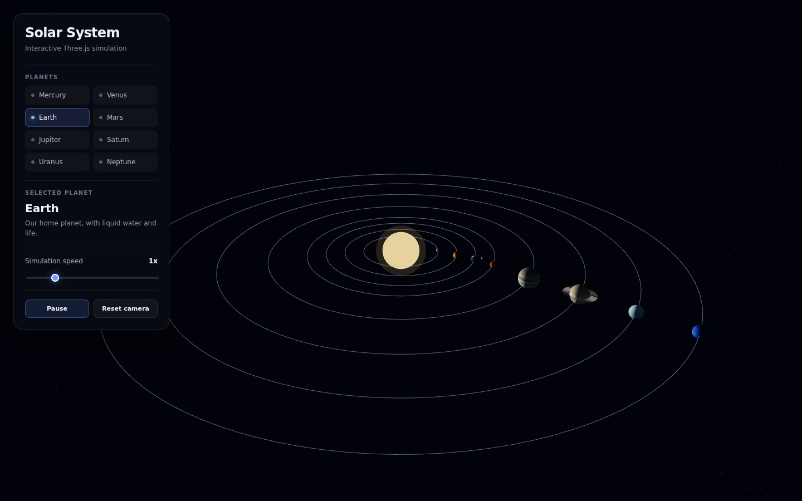
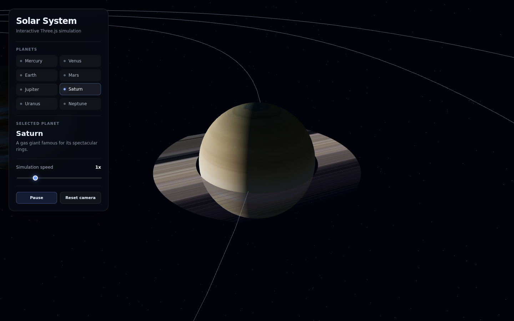

# Three.js Solar System

An interactive 3D Solar System built with Three.js and vanilla JavaScript.

Eight textured planets orbit a light-emitting Sun against a procedurally generated star field. The scene can be explored freely with orbit controls, or driven through a small UI panel: pick a planet to focus the camera on it, read a short description, adjust the simulation speed, pause the animation, or reset the view.

**[Open the live demo](https://stiutin.github.io/threejs-solar-system/)**

<p align="center">
  
  
</p>

## Features

- Eight planets with individual textures, sizes, orbital distances and rotation speeds
- Earth rendered as two layers: a surface sphere plus a semi-transparent cloud shell rotating at its own rate
- The Moon orbiting Earth on its own pivot
- Saturn with a textured ring mesh
- Visible orbit lines for every planet
- Procedural star field of 5,000 points
- Sun as a point light source with an additive glow shell
- Camera focus on any planet from the UI, plus a reset-camera action
- Simulation speed control from 0x to 5x and a pause/resume toggle
- Frame-rate independent animation driven by elapsed time
- Responsive canvas and a mobile layout for the UI panel

## Tech stack

Vanilla JavaScript, [Three.js](https://threejs.org/), [Vite](https://vitejs.dev/), WebGL, HTML5, CSS3.
No framework, no UI library. Tested with [Playwright](https://playwright.dev/).

## How it works

### Scene and rendering

A single `Scene` holds everything. A `PerspectiveCamera` (50° FOV) is driven by `OrbitControls` with damping and clamped zoom distance. The `WebGLRenderer` is configured with `SRGBColorSpace` output, ACES filmic tone mapping, anisotropic filtering on every texture, and a pixel ratio capped at 2 so high-DPI screens don't render four times the pixels for no visible gain. A `Fog` fades distant objects into the background colour.

All tunable values (radii, orbital distances, speeds, colours, star count, light intensity) live in a single `CONFIG` object at the top of `src/main.js`, so the look of the scene can be changed without touching the logic.

### Lighting

A `PointLight` placed inside the Sun mesh lights the planets from the centre outward, with decay disabled so distant planets stay readable. A dim blue `AmbientLight` keeps the dark sides from going pure black. The Sun itself uses `MeshBasicMaterial` so it is unaffected by lighting, wrapped in a larger back-facing sphere with additive blending to fake a glow.

### Planets and orbits

Each planet is a `SphereGeometry` mesh with a `MeshPhongMaterial`, positioned at its orbital distance and parented to an `Object3D` pivot at the origin. Rotating the pivot moves the planet along its orbit; rotating the mesh spins the planet on its axis. Orbit lines are built from an `EllipseCurve` sampled into a `LineLoop`.

```
Object3D (orbit pivot, rotates → orbital motion)
  └── Mesh (planet, rotates → axial spin)
        ├── Mesh (clouds / rings)
        └── Object3D (moon pivot)
              └── Mesh (moon)
```

### Star field

Positions are generated on a sphere of fixed radius using uniformly distributed spherical coordinates, written into a `Float32Array` and rendered as a single `Points` object with `PointsMaterial`. One draw call for 5,000 stars, instead of 5,000 meshes.

### Animation loop

The render loop uses `renderer.setAnimationLoop()`, which lets the browser pause rendering when the tab is hidden. `THREE.Timer` provides the delta between frames, and every rotation is multiplied by that delta and by the current speed multiplier, so the simulation runs at the same rate on a 60 Hz laptop and a 144 Hz monitor.

### UI

The control panel is generated in JavaScript, appended to the body and styled with plain CSS. Planet buttons are built from the same `CONFIG.planets` object that builds the scene, so adding a planet to the config adds it to the UI automatically. Focusing a planet reads its world position and moves both the camera and the orbit-controls target toward it.

## Testing

| Layer      | Tool       | What it covers                                                                                |
| ---------- | ---------- | --------------------------------------------------------------------------------------------- |
| End-to-end | Playwright | the production build on desktop and mobile: loads without errors, controls work - 3 scenarios |

WebGL output is hard to assert pixel by pixel, so the tests check behaviour instead: no uncaught errors or console messages, the canvas appears, and the controls do what they say. CI runs the suite against the exact build it deploys.

## Project structure

```
src/
├── main.js          # scene setup, planet factories, UI, animation loop
└── style.css        # UI and responsive styles

public/
└── textures/        # planet textures (WebP), served as static assets

e2e/                 # Playwright smoke tests
scripts/             # README screenshots
.github/workflows/   # CI: lint, build, smoke tests, deploy to GitHub Pages
```

## Asset loading

Textures live in `public/` and are copied into the build untouched. The site is a GitHub Pages project site, served under a sub-path, so texture URLs are resolved against Vite's base URL:

```js
const BASE_URL = import.meta.env.BASE_URL;
const earthTexture = `${BASE_URL}textures/earth/earth_day.webp`;
```

With a relative `base` in `vite.config.js`, the same code works at `/` locally and at `/threejs-solar-system/` in production.

## Running locally

Requires Node 22.22.3 or newer (see `.nvmrc`).

```bash
git clone https://github.com/stiutin/threejs-solar-system.git
cd threejs-solar-system
npm ci
npm start
```

Other scripts:

```bash
npm run build          # production build into dist/
npm run serve          # serve the production build
npm run e2e            # build, then the Playwright smoke tests (run `npm run e2e:install` once)
npm run screenshots    # regenerate the README screenshots
npm run lint           # ESLint and Stylelint
npm run format         # Prettier
npm run check          # formatting and lint, as in CI
```

Working on the project with an AI assistant? [`CLAUDE.md`](CLAUDE.md) has the full context.

## Deployment

Pushing to `master` runs formatting and lint, then builds the site and runs the Playwright smoke tests against that build. Only when they pass is the same build published to GitHub Pages. Vite uses a relative `base`, so the files work under `/threejs-solar-system/` without any configuration.

## Roadmap

- [ ] Camera that keeps tracking a focused planet as it orbits
- [ ] Click planets directly in the scene with a `Raycaster`
- [ ] Planet labels rendered over the canvas
- [ ] Elliptical orbits and more accurate relative sizes
- [ ] Bloom and other post-processing on the Sun
- [ ] TypeScript migration

## Credits

Planet and moon textures by [Solar System Scope](https://www.solarsystemscope.com/textures/),
licensed under [CC BY 4.0](https://creativecommons.org/licenses/by/4.0/). The
originals are 2048x1024; the copies in this repository are downscaled and
converted to WebP.

## License

Released under the [MIT License](LICENSE). The licence covers the source code;
the textures remain under CC BY 4.0 as noted above.

## Author

**Serge Tiutin** - [github.com/stiutin](https://github.com/stiutin)
