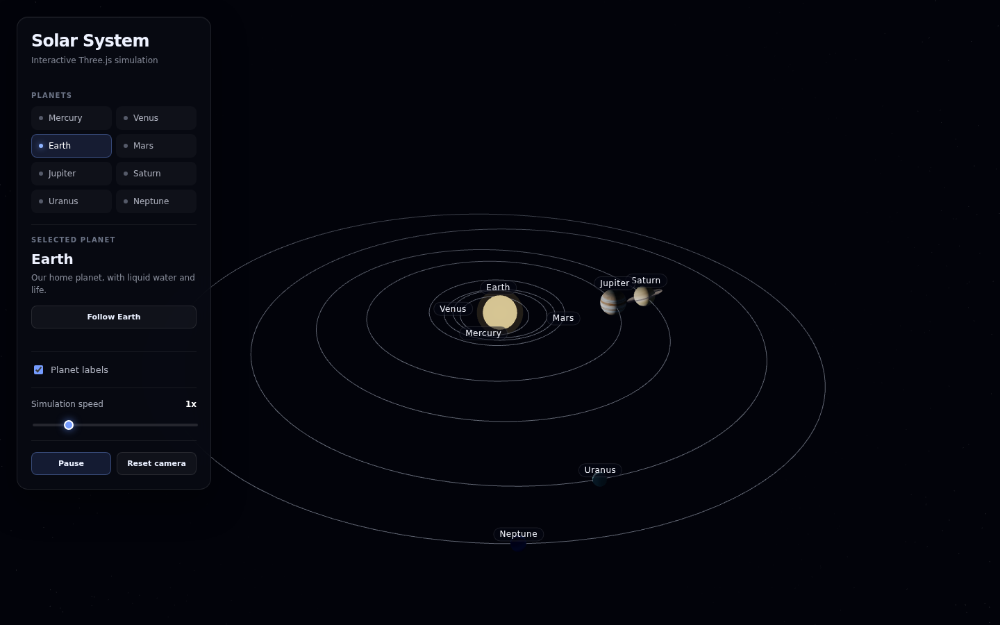
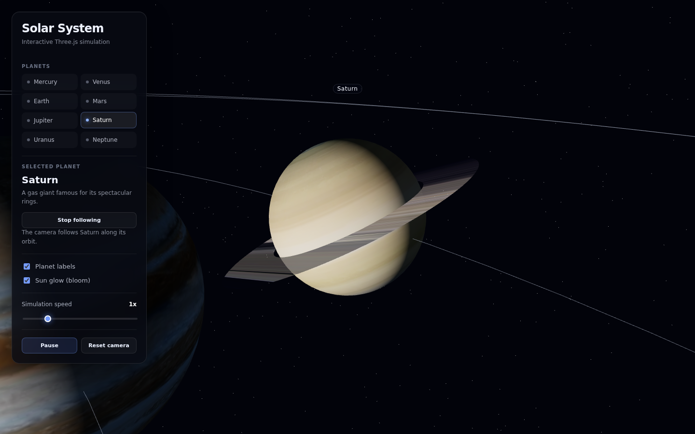

# Three.js Solar System

An interactive 3D Solar System built with Three.js and vanilla JavaScript.

Eight textured planets orbit a light-emitting Sun against a procedurally generated star field. The scene can be explored freely with orbit controls, or driven through a small UI panel: pick a planet to focus the camera on it, read a short description, adjust the simulation speed, pause the animation, or reset the view.

**[Open the live demo](https://stiutin.github.io/threejs-solar-system/)**

<p align="center">
  
  
</p>

## Features

- Eight planets with individual textures, sizes, orbital distances and rotation speeds
- Earth rendered as two layers: a surface sphere plus a semi-transparent cloud shell rotating at its own rate
- The Moon orbiting Earth on its own pivot
- Saturn with a textured ring mesh
- Visible orbit lines for every planet
- Procedural star field of 5,000 points
- Sun as a point light source with an additive glow shell
- Camera focus on any planet from the UI: a short flight there, then the camera rides along the planet's orbit until you stop it; plus a reset-camera action
- Click any planet in the scene to focus it, with a pointer and its name on hover; small, distant planets count as hit when the click lands near them
- Simulation speed control from 0x to 5x and a pause/resume toggle
- Frame-rate independent animation driven by elapsed time
- Responsive canvas; on a phone the panel folds away once you choose a planet, leaving it in view
- Planet names float over the scene, follow their planets and focus them when clicked; a checkbox hides them
- Reduced motion respected: the camera jumps instead of flying, and the loader goes without a fade

## Tech stack

Vanilla JavaScript, [Three.js](https://threejs.org/), [Vite](https://vitejs.dev/), WebGL, HTML5, CSS3.
No framework, no UI library. Tested with [Playwright](https://playwright.dev/).

## How it works

### Scene and rendering

A single `Scene` holds everything. A `PerspectiveCamera` (50° FOV) is driven by `OrbitControls` with damping and clamped zoom distance. The `WebGLRenderer` is configured with `SRGBColorSpace` output, ACES filmic tone mapping, anisotropic filtering on every texture, and a pixel ratio capped at 2 so high-DPI screens don't render four times the pixels for no visible gain. A `Fog` fades distant objects into the background colour.

All tunable values (radii, orbital distances, speeds, colours, star count, light intensity) live in a single `CONFIG` object at the top of `src/main.js`, so the look of the scene can be changed without touching the logic.

### Lighting

A `PointLight` placed inside the Sun mesh lights the planets from the centre outward, with decay disabled so distant planets stay readable. A dim blue `AmbientLight` keeps the dark sides from going pure black. The Sun itself uses `MeshBasicMaterial` so it is unaffected by lighting, wrapped in a larger back-facing sphere with additive blending to fake a glow.

### Planets and orbits

Each planet is a `SphereGeometry` mesh with a `MeshPhongMaterial`, positioned at its orbital distance and parented to an `Object3D` pivot at the origin. Rotating the pivot moves the planet along its orbit; rotating the mesh spins the planet on its axis. Orbit lines are built from an `EllipseCurve` sampled into a `LineLoop`.

```
Object3D (orbit pivot, rotates → orbital motion)
  └── Mesh (planet, rotates → axial spin)
        ├── Mesh (clouds / rings)
        └── Object3D (moon pivot)
              └── Mesh (moon)
```

### Star field

Positions are generated on a sphere of fixed radius using uniformly distributed spherical coordinates, written into a `Float32Array` and rendered as a single `Points` object with `PointsMaterial`. One draw call for 5,000 stars, instead of 5,000 meshes.

### Animation loop

The render loop uses `renderer.setAnimationLoop()`, which lets the browser pause rendering when the tab is hidden. `THREE.Timer` provides the delta between frames, and every rotation is multiplied by that delta and by the current speed multiplier, so the simulation runs at the same rate on a 60 Hz laptop and a 144 Hz monitor.

### Following a planet

Picking a planet starts a flight of 1.2 seconds, eased in and out. The camera does not aim at where the planet was when the flight began: on every frame it moves towards where the planet is now, so it lands on a moving target. The flight runs on real time, so pausing or speeding up the simulation does not change it, and the orbit controls are switched off until it lands. With reduced motion the camera goes there at once.

After landing, the camera rides along. Each frame, the camera and the orbit-controls target are turned around the Sun by the angle the planet travelled and moved with it, so they keep their place relative to both the planet and the Sun. The side of the planet in view, and its lighting, stay as they were, and any angle or zoom picked with the mouse or a finger is kept too. The panel says what the camera is doing ("Flying to Mars…", "The camera follows Mars along its orbit."), and its Follow button stops or restarts the ride.

### Picking planets in the scene

A click on the canvas becomes a ray from the camera through the pointer, with `THREE.Raycaster`. It is tested against each planet's anchor and everything under it, so Earth's clouds and Moon pick Earth and Saturn's ring picks Saturn; the nearest hit wins, so a planet behind another cannot be picked through it. Mercury and Mars are a few pixels across from afar, so a click that misses every mesh still picks the planet whose centre is within 14 pixels on screen.

The orbit controls use the same pointer, so a click is told apart from a drag: a press and release less than 5 pixels apart picks, anything longer turns the view. Hovering with a mouse shows a pointer and the planet's name, raycasting at most once a frame. Keyboard and screen reader users have the same choice in the panel, which stays the accessible way in.

### Planet labels

The names over the scene are HTML, not geometry. `CSS2DRenderer` from the Three.js addons draws a layer of DOM elements over the canvas and, on every frame, moves each label to where its anchor projects on screen, and hides it when it is behind the camera. Each label hangs from its planet's anchor, a little above the planet (1.6 radii), so it travels along the orbit and never covers the planet itself. Being HTML, the labels stay sharp at any pixel ratio and take a click like any element; the layer itself lets the pointer through to the orbit controls. They are hidden from screen readers, which have the panel's planet list.

### UI

On a phone the panel would cover most of the scene, so it can fold down to its header: the title, the chosen planet and a Show controls / Hide controls button with `aria-expanded`. Choosing a planet folds it, so the camera's flight ends on a planet you can see; the button opens it again. Wider screens have room for both, and there the panel never folds.

The control panel is generated in JavaScript, appended to the body and styled with plain CSS. Planet buttons are built from the same `CONFIG.planets` object that builds the scene, so adding a planet to the config adds it to the UI automatically. The status line under the planet's description is a live region, so screen readers hear when the camera starts and stops following.

### Asset loading

Textures live in `public/` and are copied into the build untouched. The site is a GitHub Pages project site, served under a sub-path, so texture URLs are resolved against Vite's base URL:

```js
const BASE_URL = import.meta.env.BASE_URL;
const earthTexture = `${BASE_URL}textures/earth/earth_day.webp`;
```

With a relative `base` in `vite.config.js`, the same code works at `/` locally and at `/threejs-solar-system/` in production.

## Testing

| Layer      | Tool       | What it covers                                                                                                                                                                                                                                                                                                                                                                                   |
| ---------- | ---------- | ------------------------------------------------------------------------------------------------------------------------------------------------------------------------------------------------------------------------------------------------------------------------------------------------------------------------------------------------------------------------------------------------ |
| End-to-end | Playwright | the production build on desktop and mobile: loads without errors, controls work, a focused planet stays in view as it orbits and leaves it when released, flight or jump depending on reduced motion, clicking a planet in the scene focuses it while a drag does not, the hover pointer and name, the panel folding on a phone, labels that focus their planet and can be hidden - 10 scenarios |

WebGL output is hard to assert pixel by pixel, so the tests check behaviour instead: no uncaught errors or console messages, the canvas appears, and the controls do what they say. To see whether the camera follows, a test reads the average brightness of the centre of the view from a screenshot: a planet fills it while followed, and empty space takes over once it is released. CI runs the suite against the exact build it deploys.

## Project structure

```
src/
├── main.js          # scene setup, planet factories, UI, animation loop
└── style.css        # UI and responsive styles

public/
└── textures/        # planet textures (WebP), served as static assets

e2e/                 # Playwright smoke tests
scripts/             # README screenshots
.github/workflows/   # CI: lint, build, smoke tests, deploy to GitHub Pages
```

## Running locally

Requires Node 22.22.3 or newer (see `.nvmrc`).

```bash
git clone https://github.com/stiutin/threejs-solar-system.git
cd threejs-solar-system
npm ci
npm start
```

Other scripts:

```bash
npm run build          # production build into dist/
npm run serve          # serve the production build
npm run e2e            # build, then the Playwright smoke tests (run `npm run e2e:install` once)
npm run screenshots    # regenerate the README screenshots
npm run lint           # ESLint and Stylelint
npm run format         # Prettier
npm run check          # formatting and lint, as in CI
```

Working on the project with an AI assistant? [`CLAUDE.md`](CLAUDE.md) has the full context.

## Deployment

Pushing to `master` runs formatting and lint, then builds the site and runs the Playwright smoke tests against that build. Only when they pass is the same build published to GitHub Pages. Vite uses a relative `base`, so the files work under `/threejs-solar-system/` without any configuration.

## Roadmap

- [ ] Elliptical orbits and more accurate relative sizes
- [ ] Bloom and other post-processing on the Sun
- [ ] TypeScript migration

## Credits

Planet and moon textures by [Solar System Scope](https://www.solarsystemscope.com/textures/),
licensed under [CC BY 4.0](https://creativecommons.org/licenses/by/4.0/). The
originals are 2048x1024; the copies in this repository are downscaled and
converted to WebP.

## License

Released under the [MIT License](LICENSE). The licence covers the source code;
the textures remain under CC BY 4.0 as noted above.

## Author

**Serge Tiutin** - [github.com/stiutin](https://github.com/stiutin)
